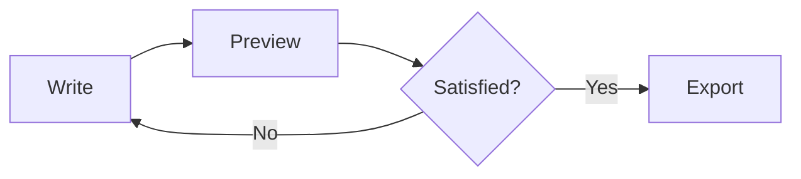
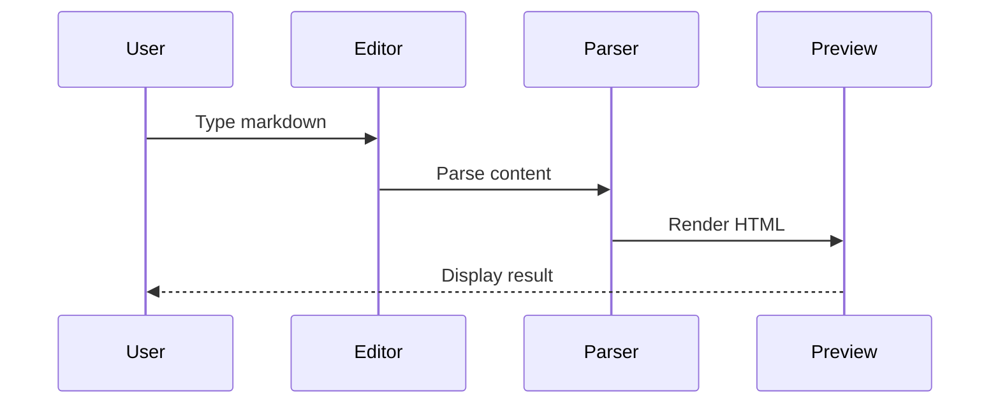
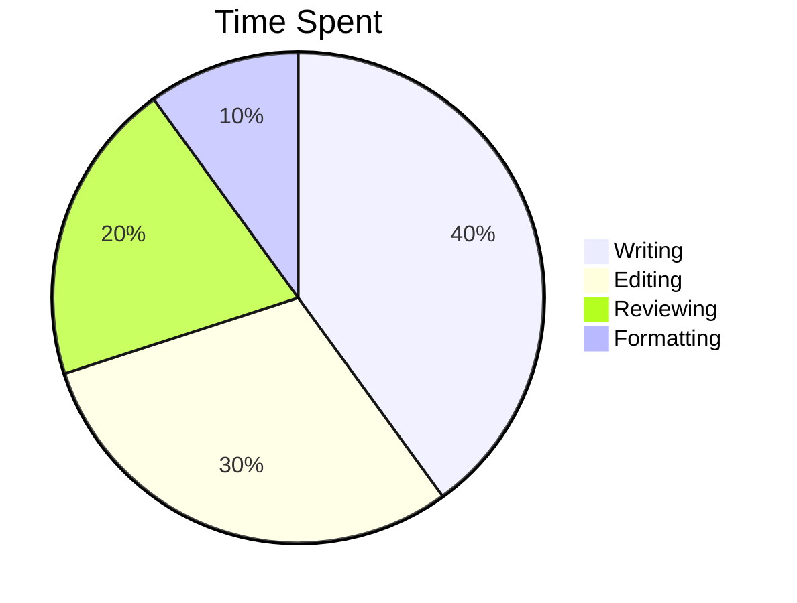

# QuillSwift Feature Showcase

> A comprehensive demonstration of all markdown features supported by QuillSwift.

---

## Typography

### Headings

# Heading 1
## Heading 2
### Heading 3
#### Heading 4
##### Heading 5
###### Heading 6

### Emphasis

*Italic text* and _also italic_

**Bold text** and __also bold__

***Bold and italic*** and ___also bold and italic___

~~Strikethrough text~~

### Inline Elements

This is `inline code` within a sentence.

This is a [link to GitHub](https://github.com).

This is an .

---

## Block Elements

### Blockquotes

> This is a blockquote.
>
> It can span multiple paragraphs.
>
> > And can be nested.
> >
> > > Even deeply nested!

### Code Blocks

Indented code block:

    function hello() {
        console.log("Hello!");
    }

Fenced code block with syntax highlighting:

```swift
@main
struct QuillSwiftApp: App {
    var body: some Scene {
        DocumentGroup(newDocument: MarkdownDocument()) { file in
            ContentView(document: file.$document)
        }
    }
}
```

### Horizontal Rules

---

***

___

---

## Lists

### Unordered Lists

- Item 1
- Item 2
  - Nested item 2.1
  - Nested item 2.2
    - Deeply nested
- Item 3

Alternative markers:

* Star item
+ Plus item
- Minus item

### Ordered Lists

1. First item
2. Second item
   1. Nested 2.1
   2. Nested 2.2
3. Third item

Starting at different numbers:

5. Fifth
6. Sixth
7. Seventh

### Task Lists

- [ ] Unchecked
- [x] Checked
- [/] In progress
- [!] Important
- [-] Blocked
- [>] Future

---

## Tables

| Syntax | Description | Example |
|--------|-------------|---------|
| Headers | Column titles | `| Header |` |
| Rows | Data cells | `| Cell |` |
| Alignment | Left/Center/Right | `:--` `:--:` `--:` |

| Left | Center | Right |
|:-----|:------:|------:|
| L | C | R |

---

## Mermaid Diagrams

### Flowchart



### Sequence Diagram



### Pie Chart



---

## Special Features

### Math (LaTeX)

Inline math: $E = mc^2$

Display math:

$$
\frac{-b \pm \sqrt{b^2 - 4ac}}{2a}
$$

### Footnotes

This has a footnote[^1].

[^1]: Here's the footnote content.

### Abbreviations

HTML is great.

*[HTML]: HyperText Markup Language

### Definition Lists

Markdown
: A lightweight markup language

QuillSwift
: A native macOS markdown editor

---

## Media

### Images


### Image with Link

[](https://example.com)

---

## Raw HTML (if supported)

<details>
<summary>Click to expand</summary>

This is hidden content that can be revealed by clicking.

</details>

<kbd>Cmd</kbd> + <kbd>S</kbd> to save

---

## Escaping

\*Not italic\*

\`Not code\`

\[Not a link\](url)

---

*End of feature showcase. All elements above should render correctly in QuillSwift.*
