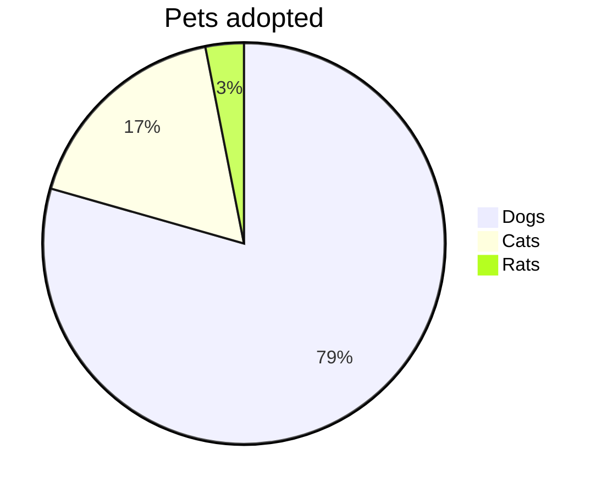

# Math and Diagrams

Manual test for Settings → Preview → "Render math (KaTeX)" and "Render Mermaid diagrams".

## Inline math

Euler's identity $e^{i\pi} + 1 = 0$ and the area of a circle $A = \pi r^2$.

Underscores markdown must not turn into emphasis: $a_i b_j$, $x_{i,j}$, a line break $a \\ b$, absolute value $|x|$.

Inequalities: $x<y$ and $y>z$.

## Not math

It costs $5 and $10 today (currency stays text).

An escaped dollar: \$20, and \$x\$ stays literal.

Inline code keeps dollars: `$HOME` and `echo $x$`.

```bash
echo "$PATH costs $5"
```

## Display math

$$
\frac{-b \pm \sqrt{b^2 - 4ac}}{2a}
$$

One line: $$\sum_{i=1}^{n} i = \frac{n(n+1)}{2}$$

> Inside a quote:
> $$
> \int_0^\infty e^{-x^2}\,dx = \frac{\sqrt{\pi}}{2}
> $$

A math fence:

```math
\begin{pmatrix} a & b \\ c & d \end{pmatrix}
\begin{pmatrix} x \\ y \end{pmatrix}
=
\begin{pmatrix} ax + by \\ cx + dy \end{pmatrix}
```

Invalid TeX shows in red, not a broken page: $\frac{1}{$ … and $\unknowncommand{x}$.

| Symbol | Meaning |
|--------|---------|
| $\alpha$ | alpha |
| $|v|$ | norm |

## Mermaid




A broken diagram shows a small error box:

```mermaid
flowchart LR
    A --> 
    this is not valid ((( 
```

## Obsidian plugin blocks

```dataview
TABLE file.mtime AS "Modified"
FROM "Projects"
SORT file.mtime DESC
```

```tasks
not done
due before tomorrow
```

The end.
