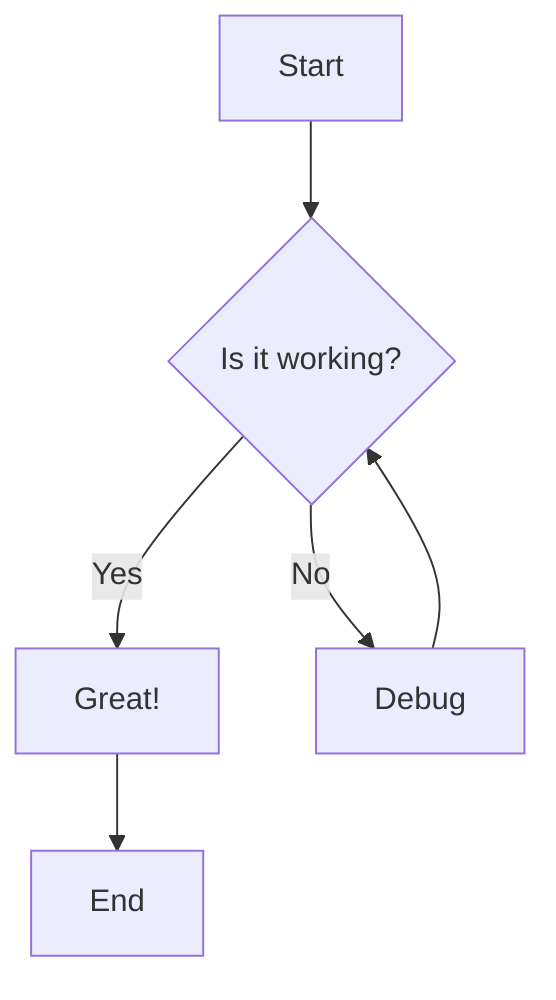
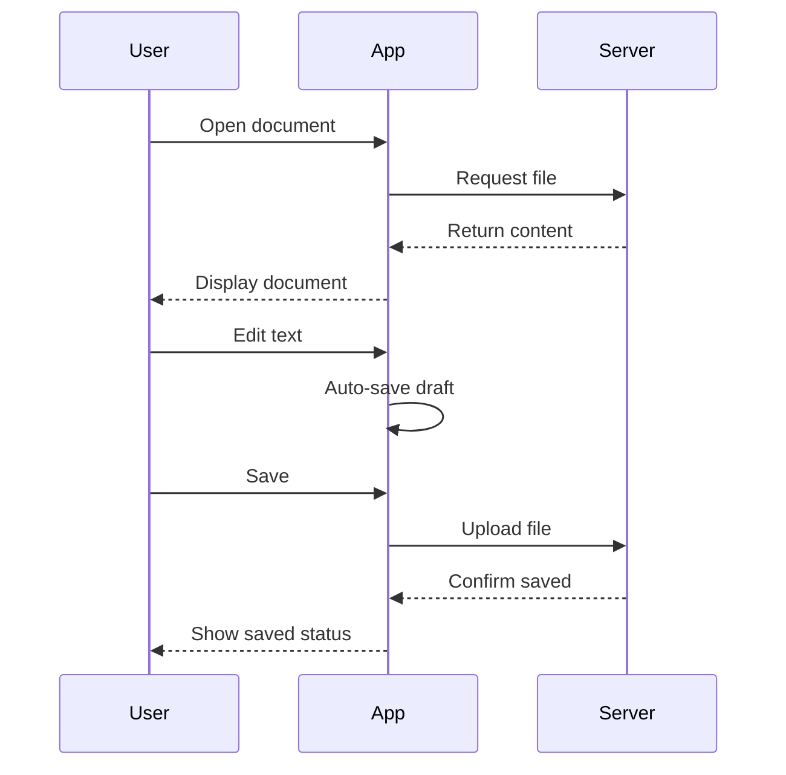
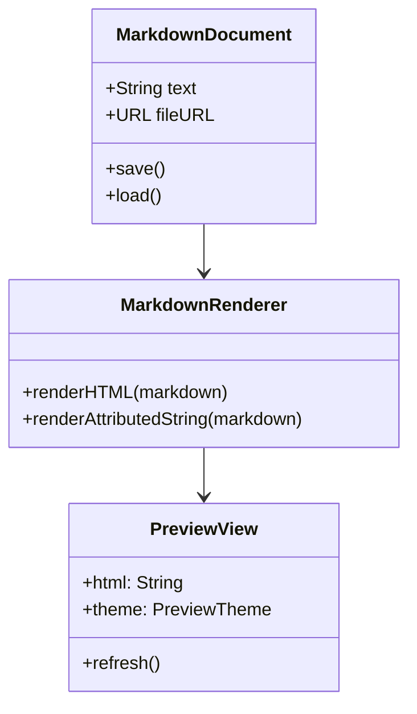
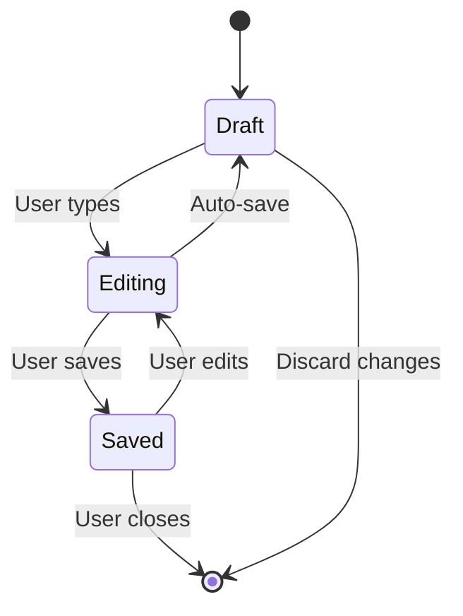
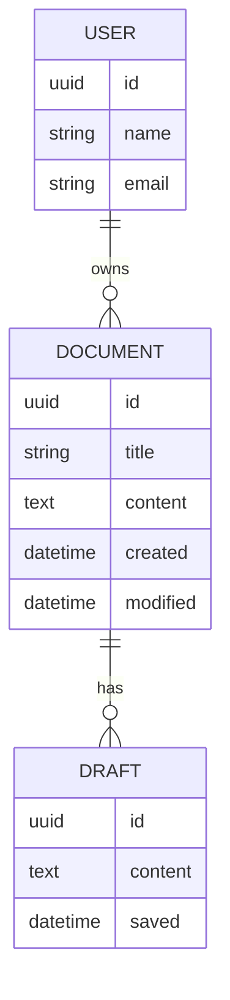
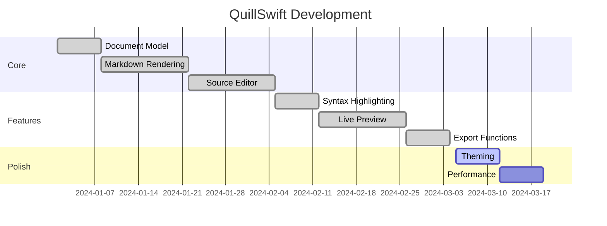
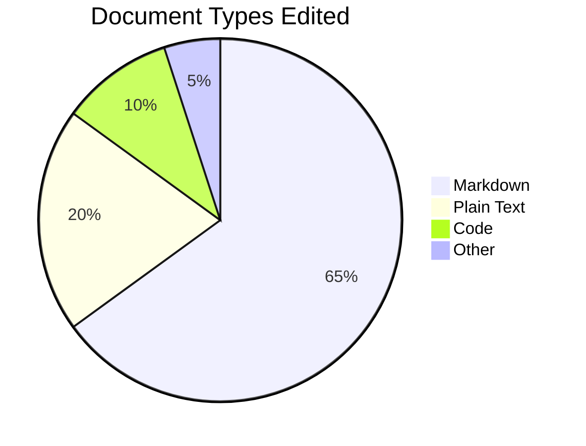
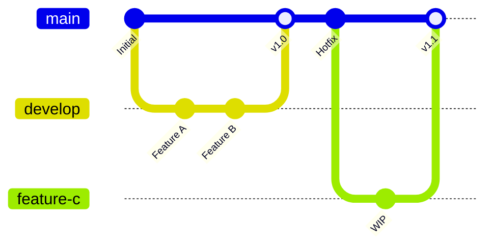
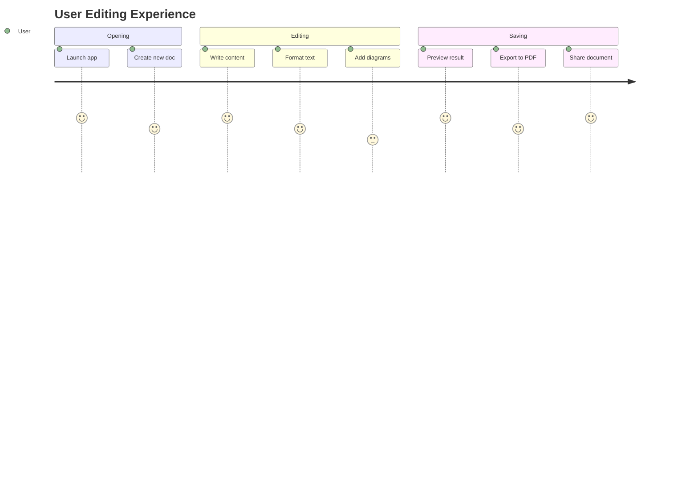

# Mermaid Diagram Examples

This document showcases various Mermaid diagram types supported by QuillSwift.

## Flowchart

## Sequence Diagram

## Class Diagram

## State Diagram

## Entity Relationship Diagram

## Gantt Chart

## Pie Chart

## Git Graph

## Journey Diagram

---

*All diagrams above should render in the preview pane.*
